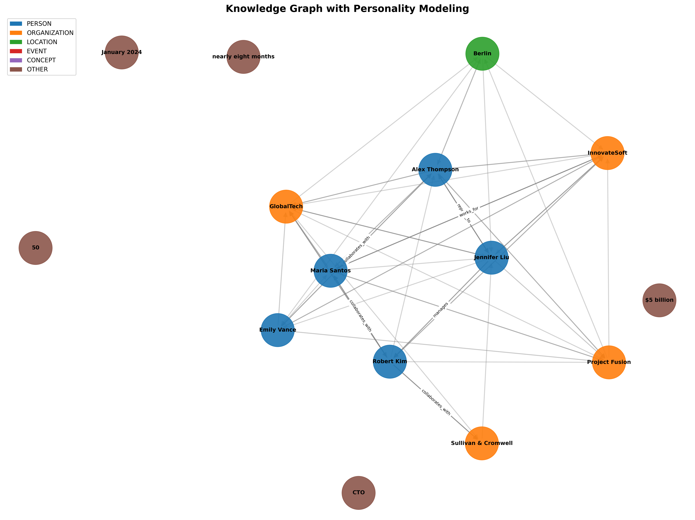
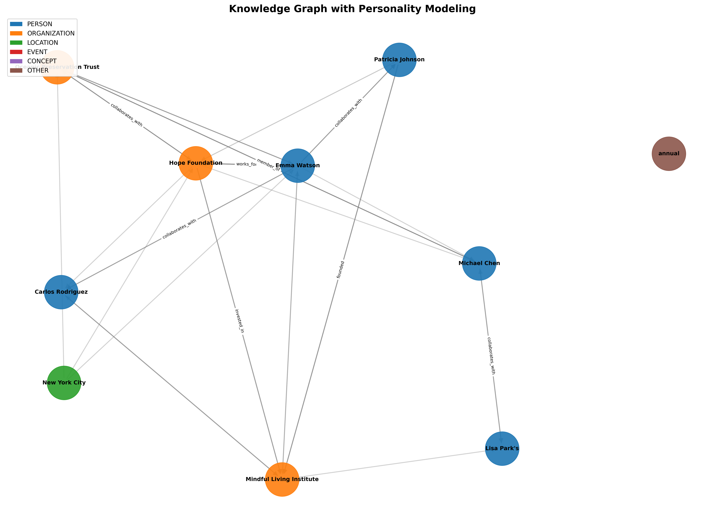

# Knowledge Graph Construction with Personality Modeling

This project implements a **Knowledge Graph (KG) construction pipeline** with a focus on **personality modeling**. It uses **Large Language Models (LLMs)**, NLP techniques, and graph analysis to extract entities, relationships, and personality traits from text. The system generates structured knowledge representations and visualizations while evaluating graph quality, completeness, and consistency.

---

## Table of Contents

- [Features](#features)  
- [Project Overview](#project-overview)  
- [Setup](#setup)  
- [Usage](#usage)  
- [Pipeline Components](#pipeline-components)  
  - [1. Synthetic Data Generator](#1-synthetic-data-generator)  
  - [2. Entity Extraction](#2-entity-extraction)  
  - [3. Relationship Extraction](#3-relationship-extraction)  
  - [4. Personality Inference With Report Summary](#4-personality-inference)  
  - [5. Knowledge Graph Construction](#5-knowledge-graph-construction)  
  - [6. Graph Visualization With Examples](#6-graph-visualization)  
  - [7. Evaluation Metrics](#7-evaluation-metrics)  
- [Edge Types](#edge-types)  
- [Outputs](#outputs)  
- [Quick Example](#quick-example)  
- [Future Improvements](#future-improvements)  

---

## Features

- Automatic extraction of **entities**: Person, Organization, Location, Event, Concept  
- **Relationship extraction** using LLMs with support for:
  - Explicit semantic relations (`affiliated_with`, `works_with`, etc.)  
  - Co-occurrence based edges (`co_occurs`) to densify the graph  
- **Personality profiling** (Big Five traits) for person entities, including behaviors and emotional states  
- **Graph construction** and visualization using `networkx` and `matplotlib`  
- Comprehensive **evaluation** for completeness, consistency, and structural graph quality  
- Export of KG to JSON for further analysis  

---

## Project Overview

The system processes raw text documents and outputs:

1. Extracted entities and relationships
2. Personality profiles for person entities
3. Visual knowledge graph  
4. Evaluation report for graph quality  

It is designed for **synthetic, business, narrative, and social documents**, making it adaptable for both academic and industry datasets.

---

## Setup

### Requirements

- Python 3.10+  
- Packages:  

```bash
pip install -m requirements.txt
python -m spacy download en_core_web_sm
```

- Access to **Ollama Gemma 3 LLM** (`gemma3:12b`)  

---

## Usage

1. Clone the repository:

```bash
git clone https://github.com/your-username/knowledge-graph-personality.git
cd knowledge-graph-personality
```

2. Run the main pipeline:

```bash
python knowledge_graph_solution.py
```

3. Output files:

- `kg_<doc_type>.json` → Graph data in JSON  
- `kg_<doc_type>.png` → Graph visualization  
- `evaluation_<doc_type>.txt` → Evaluation report  

---

## Pipeline Components

### 1. Synthetic Data Generator

Generates three types of documents for testing:

- Narrative: Focuses on storytelling with rich personality cues  
- Business: Corporate events, mergers, and leadership behaviors  
- Social: Social interactions and events with emotional context  

### 2. Entity Extraction

- Uses **spaCy NLP** to identify entities  
- Entity types: `PERSON`, `ORGANIZATION`, `LOCATION`, `EVENT`, `CONCEPT`  
- Removes duplicates and counts mentions  

### 3. Relationship Extraction

- Uses **LLM-based extraction** (Gemma 3)  
- Two-pass approach:
  1. LLM extracts explicit relationships  
  2. Densification via **co-occurrence edges**  

- Relationship attributes:
  - `source`, `target`, `relation_type`, `confidence`  

### 4. Personality Inference

- Infers **Big Five traits** for each person entity  
- Lists **behaviors** and **emotional states**  
- Uses LLM prompts for contextual understanding  

Below is the report generated from the narrative document:


### 5. Knowledge Graph Construction

- Nodes = Entities  
- Edges = Relationships (LLM + co-occurrence + affiliation)  
- Node attributes include entity type, personality traits, behaviors, emotions  

### 6. Graph Visualization

- Uses **networkx** + **matplotlib**  
- Nodes colored by type: Person, Organization, Location, etc.  
- Edge types: `affiliated_with`, `co_occurs`, `works_with`  
- Supports saving as PNG for reporting  

Below are the knowledge graphs generated from the narratives:




### 7. Evaluation Metrics

#### **Completeness**
- Fraction of person entities with personality profiles  
- Number of entities and relationships extracted  

#### **Consistency**
- Check Big Five trait ranges (0–1)  
- High neuroticism aligns with negative emotions  

#### **Graph Quality**
- Number of weakly connected components  
- Connectivity ratio of largest component  
- Average clustering coefficient  
- Graph density  

---

## Edge Types

| Type                | Meaning                                        | Strength      |
|--------------------|------------------------------------------------|---------------|
| `co_occurs`        | Entities appear together in the same sentence | Weak signal   |
| `affiliated_with`  | Explicit semantic connection (e.g., employment, membership) | Strong signal |
| `works_with`       | Collaborative relationship between entities   | Strong signal |

---

## Outputs

- JSON files with full KG: entities, relationships, personalities  
- Visual graphs (PNG) for presentation  
- Text-based evaluation reports  

---

## Quick Example

### Input Text (Narrative Document)
```
Sarah Chen, a seasoned software engineer at TechCorp, has always been known for her innovative thinking...
```

### Extracted Entities
- Sarah Chen (PERSON)  
- TechCorp (ORGANIZATION)  
- San Francisco (LOCATION)  
- John Smith (PERSON)  

### Relationships
- Sarah Chen → TechCorp (`affiliated_with`)  
- Sarah Chen → John Smith (`works_with`)  
- Sarah Chen ↔ San Francisco (`co_occurs`)  

### Personality Profile (Example)
- Openness: 0.85  
- Conscientiousness: 0.9  
- Extraversion: 0.75  
- Agreeableness: 0.8  
- Neuroticism: 0.35  
- Behaviors: mentoring, problem-solving, volunteering  
- Emotions: enthusiastic, calm, empathetic  

### Visualization
- Graph shows nodes for each entity with edges indicating relationships  
- Colors indicate entity type  
- Edge thickness or style can indicate confidence or type  

---

